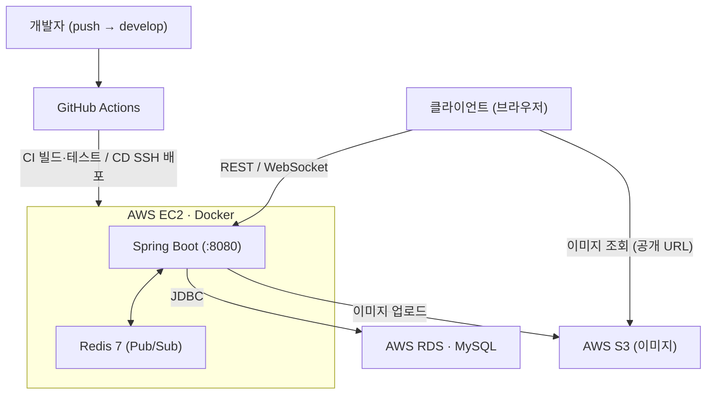
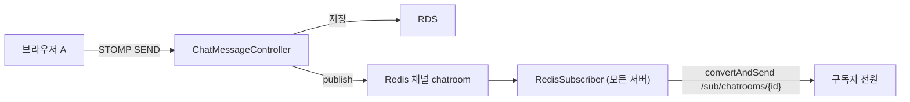
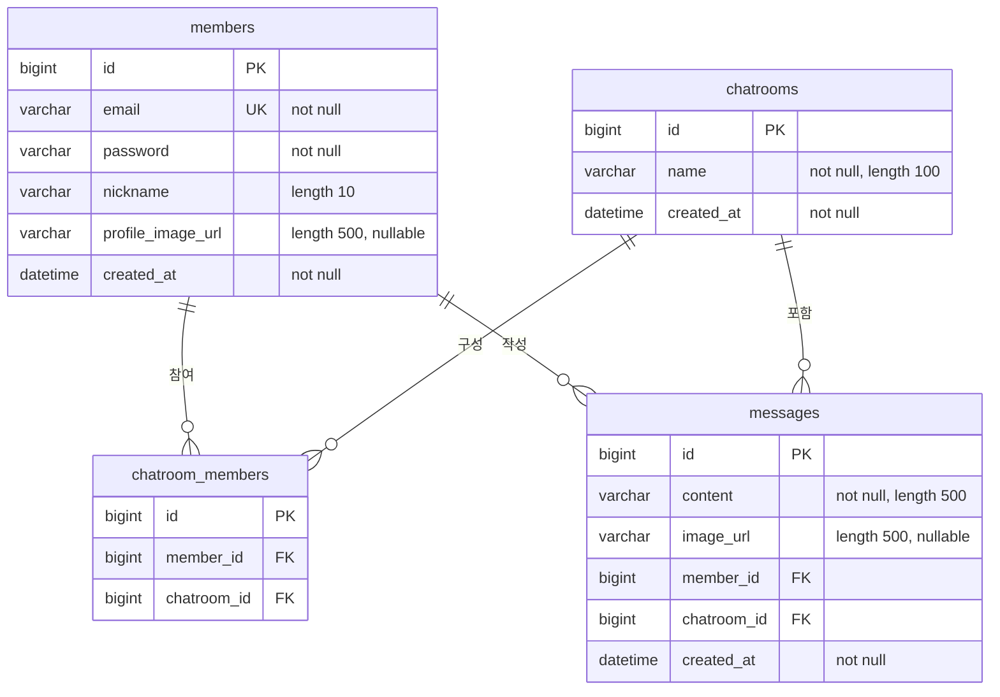

<div align="center">

# 💬 Realtime Chat

**Chat + Scale**

JWT 인증부터 **Redis Pub/Sub 다중 서버 확장**, **AWS 배포와 CI/CD 자동화**까지
하나의 실시간 채팅 서비스를 처음부터 끝까지 완성한 프로젝트

</div>

---

## Table of Contents

- [서비스 소개](#-서비스-소개)
- [이 프로젝트의 포인트](#-이-프로젝트의-포인트)
- [시스템 아키텍처](#️-시스템-아키텍처)
- [ERD](#️-erd)
- [기술 스택](#️-기술-스택)
- [API 문서](#-api-문서)
- [실행 방법](#-실행-방법)
- [트러블슈팅](#-트러블슈팅)
- [만든 사람](#-만든-사람)

---

## 💬 서비스 소개

실시간으로 대화하고, 이미지를 주고받는 채팅 서비스입니다.
단순히 "채팅이 되는 것"에 그치지 않고, **서버가 여러 대여도 메시지가 전달되는 구조**와 **자동으로 빌드·테스트·배포되는 파이프라인**까지 직접 구축했습니다.

| 주요 기능 | 설명 |
|---|---|
| **회원 / 인증** | 회원가입, 로그인 시 **JWT 발급**. REST는 필터로, WebSocket은 **STOMP CONNECT 시** 토큰 검증 |
| **채팅방** | 생성 · 조회 · 입장 · 나가기 · 참여자 목록. 미참여자의 메시지 전송 차단 |
| **실시간 채팅** | **WebSocket(STOMP)** 송수신. **Redis Pub/Sub** 경유로 **모든 서버의 구독자**에게 브로드캐스트 |
| **이미지** | **S3** 업로드 후 공개 URL 발급 → **프로필 이미지 / 채팅 이미지**로 첨부 |
| **프로필** | 프로필 이미지 변경 (본인만), 내 정보 조회 |

---

## ✨ 이 프로젝트의 포인트

| 포인트 | 흔한 구현 | 이 프로젝트 |
|---|---|---|
| **실시간 전송** | `SimpMessagingTemplate`로 직접 브로드캐스트 → **서버 1대에서만 동작** | **Redis Pub/Sub 경유** → 서버가 늘어나도 전 구독자에게 전달 |
| **데이터베이스** | 서버에 DB 컨테이너를 같이 띄움 | **RDS로 분리** → 서버 메모리 확보 + 데이터 영속 |
| **배포** | 서버에 SSH로 직접 접속해 수동 배포 | **develop 머지 → 자동 빌드·테스트·배포** |
| **테스트** | 로컬에서만 수동 실행 | CI에서 **Redis·MySQL을 띄워** 통합 테스트 자동 검증 |
| **비밀 관리** | 설정 파일에 비밀번호·시크릿 커밋 | **`.env` / GitHub Secrets**로 분리, 레포엔 값 없음 |

---

## 🏗️ 시스템 아키텍처



### 🔄 실시간 메시지 흐름 (Redis Pub/Sub)



> **왜 Redis인가?**
> `convertAndSend`는 **자기 서버에 붙은 세션에만** 메시지를 보냅니다. 서버가 2대가 되는 순간 다른 서버의 사용자에게는 닿지 않습니다.
> 그래서 **컨트롤러가 직접 브로드캐스트하지 않고 Redis에 발행**하고, **모든 서버가 구독**해서 각자 자기 클라이언트에게 전달하도록 바꿨습니다.

---

## 🗂️ ERD



- `chatroom_members`는 **Member ↔ ChatRoom의 M:N을 풀어낸 조인 테이블**이며, `UNIQUE(member_id, chatroom_id)`로 **중복 참여를 방지**합니다.
- 연관관계 주인은 FK를 가진 `Message` / `ChatRoomMember` 쪽이고, 모든 `@ManyToOne`은 `LAZY`입니다.

---

## 🛠️ 기술 스택

| Category | Technology |
|---|---|
| **Language / Build** |   |
| **Backend** |    |
| **Realtime / Auth** |   |
| **Database** |    |
| **Infrastructure** |     |
| **CI / CD** |  |
| **Docs** |  |

---

## 📡 API 문서

> Swagger UI: `http://{host}:8080/swagger-ui/index.html`
> 인증이 필요한 API는 헤더에 **`Authorization: Bearer {accessToken}`**

### 인증 / 회원

| Method | Path | 인증 | 설명 |
|:---:|---|:---:|---|
| `POST` | `/api/auth/login` | — | 로그인 → `{ tokenType, accessToken }` |
| `POST` | `/api/members` | — | 회원가입 |
| `GET` | `/api/members` | ✅ | 회원 목록 |
| `GET` | `/api/members/me` | ✅ | 내 정보 |
| `GET` | `/api/members/{id}` | ✅ | 회원 단건 조회 |
| `PATCH` | `/api/members/me/profile-image` | ✅ | 프로필 이미지 변경 |
| `DELETE` | `/api/members/me` | ✅ | 회원 탈퇴 (**본인만**) |

### 채팅방

| Method | Path | 인증 | 설명 |
|:---:|---|:---:|---|
| `POST` | `/api/chatrooms` | ✅ | 채팅방 생성 |
| `GET` | `/api/chatrooms` | ✅ | 채팅방 목록 |
| `GET` | `/api/chatrooms/{id}` | ✅ | 채팅방 조회 |
| `POST` | `/api/chatrooms/{chatroomId}/members` | ✅ | 채팅방 입장 |
| `GET` | `/api/chatrooms/{chatroomId}/members` | ✅ | 참여자 목록 |
| `DELETE` | `/api/chatrooms/{chatroomId}/members` | ✅ | 채팅방 나가기 |

### 메시지 / 이미지

| Method | Path | 인증 | 설명 |
|:---:|---|:---:|---|
| `POST` | `/api/chatrooms/{chatroomId}/messages` | ✅ | 메시지 저장 (REST, 브로드캐스트 없음) |
| `GET` | `/api/chatrooms/{chatroomId}/messages` | ✅ | 메시지 목록 |
| `POST` | `/api/images` | ✅ | 이미지 업로드 (`multipart/form-data`, 최대 10MB) → `{ "url": "..." }` |

### WebSocket (STOMP)

| 항목 | 값 |
|---|---|
| **핸드셰이크** | `ws://{host}:8080/ws` |
| **인증** | `CONNECT` 프레임 헤더 `Authorization: Bearer {token}` |
| **전송(SEND)** | `/pub/chatrooms/{chatroomId}/messages` → `{ "content": "...", "imageUrl": "..." }` |
| **구독(SUBSCRIBE)** | `/sub/chatrooms/{chatroomId}` |
| **수신 페이로드** | `{ messageId, content, imageUrl, memberId, nickname, chatroomId, createdAt }` |

> 💡 **실시간 전송은 STOMP 경로만** 브로드캐스트됩니다 (REST 메시지 API는 저장 전용).
> 💡 **이미지는 2단계** — WebSocket으로 파일을 보낼 수 없어, `POST /api/images`로 먼저 올려 URL을 받고 그 URL만 메시지에 실어 보냅니다.

---

## 🚀 실행 방법

### 1. 클론

```bash
git clone https://github.com/storyrago/realtimechat-backend.git
cd realtimechat-backend
```

### 2. 환경변수 (`.env`)

루트에 `.env` 생성 — **비밀값은 커밋하지 않습니다.**

```bash
SPRING_DATASOURCE_URL=jdbc:mysql://{DB호스트}:3306/spring_realtimechat_service
SPRING_DATASOURCE_USERNAME={DB유저}
SPRING_DATASOURCE_PASSWORD={DB비밀번호}

AWS_ACCESS_KEY_ID={S3 업로드용 IAM 키}
AWS_SECRET_ACCESS_KEY={S3 업로드용 IAM 시크릿}

JWT_SECRET={32바이트 이상 랜덤 문자열}
```

> ⚠️ `JWT_SECRET`은 **기본값이 없습니다.** 설정하지 않으면 앱이 기동되지 않습니다 (취약한 상태로 조용히 뜨는 것을 막기 위한 의도).
> 생성: `openssl rand -base64 32`

### 3. Docker Compose (권장)

```bash
./gradlew build            # Dockerfile이 build/libs의 jar를 사용하므로 먼저 빌드
docker compose up -d --build
```
- 컴포즈가 띄우는 것: **app + redis**
- 외부 의존: **MySQL(RDS)**, **S3**
- 접속: `http://localhost:8080`

### 4. 로컬 실행 (Docker 없이)

MySQL(`localhost:3306`, DB `spring_realtimechat_service`) · Redis(`localhost:6379`) 필요

```bash
export JWT_SECRET=$(openssl rand -base64 32)
./gradlew bootRun
```

### 5. 테스트

```bash
./gradlew test
```
**H2 인메모리 DB**와 더미 설정을 사용합니다.

---

## 🧩 트러블슈팅

프로젝트를 진행하며 실제로 겪고 해결한 문제들입니다.

| 문제 | 원인 | 해결 |
|---|---|---|
| **서버가 여러 대면 메시지가 안 감** | `convertAndSend`는 **자기 서버 세션에만** 전달 | **Redis Pub/Sub** 경유 브로드캐스트로 전환 |
| **컨테이너에서 DB 접속 실패** | 컨테이너 안 `localhost`는 **자기 자신** | Compose **서비스 이름**으로 접속, 설정은 env로 주입 |
| **앱이 DB보다 먼저 떠서 죽음** | `depends_on`은 **기동**만 보장, 준비 완료는 아님 | MySQL **healthcheck** + `condition: service_healthy` |
| **배포 후 앱이 계속 죽음 (OOM)** | 1GB 서버에서 MySQL까지 함께 구동 | **DB를 RDS로 분리** (+ swap, `.dockerignore`, `--no-daemon`) |
| **CI에서 테스트 전부 실패** | 러너엔 Redis/MySQL이 없음 | **service containers**로 의존 서비스 기동 |
| **JWT 시크릿이 레포에 노출** | 설정 파일에 하드코딩 | **`${JWT_SECRET}` 외부화** + 시크릿 로테이션 |

---

## 👤 만든 사람

| | |
|---|---|
| **Name** | Jamin Cheon |
| **GitHub** | [@storyrago](https://github.com/storyrago) |
| **Blog** | [velog.io/@storyrago](https://velog.io/@storyrago/posts) |

<div align="center">

**개인 학습용 프로젝트** — 새로운 기술을 늘리기보다, **하나의 서비스를 끝까지 완성**하는 것을 목표로 했습니다.

</div>
