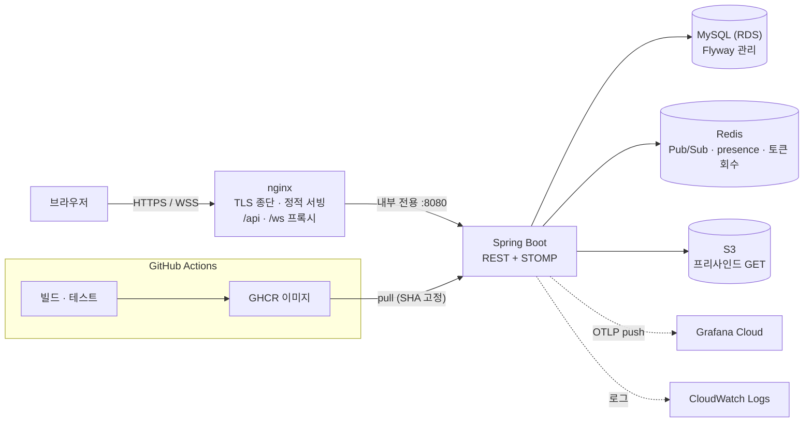
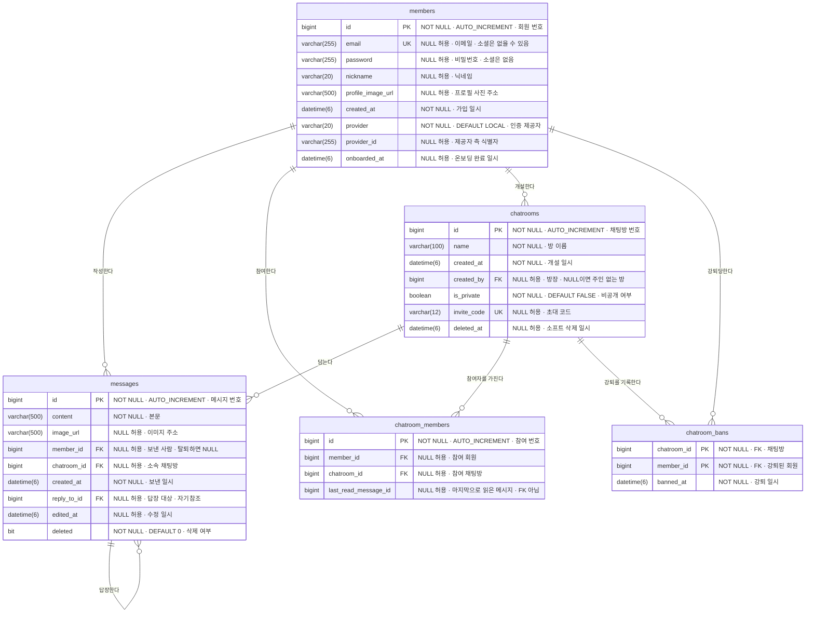

<div align="center">

# 💬 Realtime Chat

**🔗 라이브 데모 — [sagertc.duckdns.org](https://sagertc.duckdns.org)**

</div>

<!-- ════════════════ 🎬 데모 영상 자리 ════════════════
     넣는 법
       1. GitHub 웹에서 이 파일을 편집(연필 아이콘)한다
       2. 영상 파일(mp4 권장, 10MB 이하)을 편집창에 끌어다 놓으면
          https://github.com/user-attachments/assets/... URL이 자동으로 삽입된다
       3. 이 주석 블록을 통째로 지우고, 그 자리에 아래 두 줄을 넣는다
             ## 🎬 데모
             (2번에서 받은 URL 한 줄)
          GitHub은 영상 URL 한 줄만 있으면 플레이어로 렌더링한다
       4. 위 Table of Contents에 "- [데모](#-데모)" 한 줄을 추가한다

     담으면 좋은 흐름 (30~60초)
       로그인 → 우표 랜딩에서 방 선택 → 창 두 개로 실시간 송수신
       → 입력 중 표시와 안읽음 배지 → 비공개방 초대 코드 입장 → 강퇴
       → 이미지 전송
     ═══════════════════════════════════════════════════ -->

---

## Table of Contents

- [서비스 소개](#-서비스-소개)
- [시스템 아키텍처](#️-시스템-아키텍처)
- [ERD](#️-erd)
- [기술 스택](#️-기술-스택)
- [API 문서](#-api-문서)
- [실행 방법](#-실행-방법)
- [트러블슈팅](#-트러블슈팅)

---

## 💬 서비스 소개

실시간으로 대화하고, 이미지를 주고받는 채팅 서비스입니다.
단순히 "채팅이 되는 것"에 그치지 않고, **서버가 여러 대여도 메시지가 전달되는 구조**와 **자동으로 빌드·테스트·배포되는 파이프라인**까지 직접 구축했습니다.

| 주요 기능 | 설명 |
|---|---|
| **회원 / 인증** | **JWT 발급** — 이메일 · **Google** · **Kakao** OAuth. REST는 필터로, WebSocket은 **STOMP CONNECT 시** 토큰 검증. 로그아웃·탈퇴 시 **토큰 회수**(무효화 목록) |
| **온보딩** | 소셜 로그인 후 닉네임을 직접 정하는 첫 진입 흐름 |
| **채팅방 — 인가** | **공개 / 비공개(초대 코드)** 2상태 (+ 레거시 데이터에만 남은 **동결**). 목록·입장·메시지 읽기·쓰기가 모두 **참여 여부**로 갈린다 |
| **방장 운영** | 강퇴 · 차단 · 차단 해제 · 초대 코드 재발급 · 공개↔비공개 전환 · 방 삭제 · **방장 위임**. 위임·나가기·강퇴는 방 행을 **비관적 잠금**으로 잡아 경합을 막는다 |
| **실시간 채팅** | **WebSocket(STOMP)** 송수신. **Redis Pub/Sub** 경유로 **모든 서버의 구독자**에게 브로드캐스트 |
| **실시간 부가** | 방별 **접속자(presence)** · **입력 중** 표시 · **답장** · **안읽음 카운트**와 "여기부터 안 읽음" 구분선 · **나에게 온 답장** 구분 |
| **이미지** | **S3** 업로드. 채팅 이미지는 **프리사인드 URL(1시간)** 로만 열람, 프로필 사진만 공개. 업로드는 실제 디코딩까지 검증 |
| **프로필** | 프로필 이미지·닉네임 변경 (본인만), 내 정보 조회 |

---

## 🏗️ 시스템 아키텍처



- 프론트와 백엔드를 **same-origin**으로 묶어 CORS와 mixed-content를 구조적으로 없앴습니다.
- **EC2에서 빌드하지 않습니다.** Actions가 이미지를 만들어 GHCR에 올리고, EC2는 배포 대상 SHA만 `pull`합니다.
- 앱은 nginx 뒤 내부 전용이라 `8080`과 Swagger·Actuator가 외부로 열리지 않습니다.
- 점선은 관측 경로입니다. 로그는 상시 CloudWatch로 나가고, **메트릭 push는 `OTLP_METRICS_ENABLED`로 켜는 선택 항목**이라 기본값은 꺼짐입니다.

---

## 🗂️ ERD

스키마는 **Flyway**(`src/main/resources/db/migration/V1~V8`)로만 바뀝니다. 현재 구성은 다음과 같습니다.



**테이블 이름** — `members` 회원 · `chatrooms` 채팅방 · `messages` 메시지 · `chatroom_members` 방 참여 · `chatroom_bans` 강퇴 기록

복합 제약은 다이어그램 문법으로 표현되지 않아 따로 적습니다.

- `members`: `UNIQUE(provider, provider_id)` — 소셜 신원의 실제 키
- `chatroom_members`: `UNIQUE(member_id, chatroom_id)` — 중복 참여 방지
- `chatroom_bans`: `PRIMARY KEY(chatroom_id, member_id)`
- `chatroom_members.last_read_message_id`는 **FK가 아닙니다**(V2에서 컬럼만 추가). 참조 무결성은 애플리케이션이 책임집니다.

연관관계 주인은 FK를 가진 `Message` / `ChatRoomMember` 쪽이고, 모든 `@ManyToOne`은 `LAZY`입니다.

---

## 🛠️ 기술 스택

| Category | Technology |
|---|---|
| **Language / Build** |   |
| **Backend** |    |
| **Realtime / Auth** |   |
| **Frontend** |     |
| **Migration** |  |
| **Observability** |     |
| **Database** |    |
| **Infrastructure** |       |
| **CI / CD** |   |
| **Docs** |  |

---

## 📡 API 문서

> Swagger UI (로컬/개발): `http://localhost:8080/swagger-ui/index.html`
> — 운영에선 app(8080)이 **nginx 뒤 내부 전용**이라 외부로 노출하지 않습니다.
> 인증이 필요한 API는 헤더에 **`Authorization: Bearer {accessToken}`**
> 실패 응답은 `{ code, message }` 형태이며, `code`는 프론트가 분기에 쓰는 식별자입니다.

### 인증

| Method | Path | 인증 | 설명 |
|:---:|---|:---:|---|
| `POST` | `/api/auth/login` | — | 로그인 → `{ tokenType, accessToken }` |
| `POST` | `/api/auth/logout` | ✅ | 로그아웃 (**토큰 회수** — 남은 유효기간 동안 재사용 차단) |
| `POST` | `/api/auth/oauth/token` | — | 소셜 로그인 **일회용 코드 → JWT 교환** |

### 회원

| Method | Path | 인증 | 설명 |
|:---:|---|:---:|---|
| `GET` | `/api/members/me` | ✅ | 내 정보 |
| `GET` | `/api/members/{id}` | ✅ | 회원 단건 조회 |
| `PATCH` | `/api/members/me` | ✅ | 닉네임 변경 (trim 후 1~20자) |
| `POST` | `/api/members/me/onboarding` | ✅ | 온보딩 완료 기록 (**멱등**) |
| `PATCH` | `/api/members/me/profile-image` | ✅ | 프로필 이미지 변경 |
| `DELETE` | `/api/members/me` | ✅ | 회원 탈퇴 (**본인만**) |

### 채팅방

| Method | Path | 인증 | 설명 |
|:---:|---|:---:|---|
| `POST` | `/api/chatrooms` | ✅ | 방 생성 (공개 / 비공개). 생성자가 **주인이자 첫 참여자**로 등록 |
| `GET` | `/api/chatrooms` | ✅ | 방 목록 (참여 여부 · 잠금 여부 포함) |
| `PATCH` | `/api/chatrooms/{id}` | 👑 | 공개 ↔ 비공개 전환 (전환 시 **초대 코드 재발급**) |
| `DELETE` | `/api/chatrooms/{id}` | 👑 | 방 삭제 (소프트 삭제 + 실시간 통지) |
| `PATCH` | `/api/chatrooms/{id}/owner` | 👑 | **방장 위임** |
| `POST` | `/api/chatrooms/{id}/invite-code` | 👑 | 초대 코드 재발급 |
| `GET` | `/api/chatrooms/{id}/bans` | 👑 | 차단 목록 |
| `DELETE` | `/api/chatrooms/{id}/bans/{memberId}` | 👑 | 차단 해제 |

### 참여

| Method | Path | 인증 | 설명 |
|:---:|---|:---:|---|
| `POST` | `/api/chatrooms/{id}/members` | ✅ | 입장 (**비공개방은 초대 코드 필요**, 차단된 회원은 거부) |
| `GET` | `/api/chatrooms/{id}/members` | ✅ | 참여자 목록 (**해당 방 멤버만**) |
| `DELETE` | `/api/chatrooms/{id}/members` | ✅ | 나가기 (방장은 위임 후에만 가능) |
| `DELETE` | `/api/chatrooms/{id}/members/{memberId}` | 👑 | **강퇴** (+ 차단 기록, 실시간 통지) |

### 안읽음

| Method | Path | 인증 | 설명 |
|:---:|---|:---:|---|
| `GET` | `/api/chatrooms/unread` | ✅ | 방별 `{ unreadCount, replyCount, lastReadMessageId }` |
| `POST` | `/api/chatrooms/{id}/read` | ✅ | 읽음 처리 (읽음 경계를 방의 최신 메시지로 전진) |

### 메시지 / 이미지

| Method | Path | 인증 | 설명 |
|:---:|---|:---:|---|
| `POST` | `/api/chatrooms/{id}/messages` | ✅ | 메시지 저장 + 브로드캐스트 |
| `GET` | `/api/chatrooms/{id}/messages` | ✅ | 메시지 목록 (커서 페이지네이션 `before`, `limit` 최대 50) |
| `PATCH` | `/api/chatrooms/{id}/messages/{messageId}` | ✍️ | 메시지 수정 (**작성자만**) |
| `DELETE` | `/api/chatrooms/{id}/messages/{messageId}` | ✍️ | 메시지 삭제 (**작성자만**, 소프트 삭제) |
| `POST` | `/api/images?purpose=profile\|chat` | ✅ | 이미지 업로드 (`multipart/form-data`, 최대 10MB) → `{ "url": "..." }` |

> ✅ 로그인 필요 · 👑 방장만 · ✍️ 작성자만
> 💡 `purpose`는 **필수**입니다. 값에 따라 `profiles/`(공개) 또는 `rooms/{memberId}/`(비공개) 키로 저장되며, 기본값을 두지 않아 잘못 지정한 업로드가 조용히 공개되지 않습니다.

### WebSocket (STOMP)

| 항목 | 값 |
|---|---|
| **핸드셰이크** | 운영 `wss://sagertc.duckdns.org/ws` (nginx 프록시) · 로컬 `ws://localhost:8080/ws` |
| **인증** | `CONNECT` 프레임 헤더 `Authorization: Bearer {token}` |
| **전송(SEND)** | `/pub/chatrooms/{id}/messages` · `/pub/chatrooms/{id}/typing` |
| **구독(SUBSCRIBE)** | `/sub/chatrooms/{id}` (메시지) · `/sub/chatrooms/{id}/typing` · `/sub/chatrooms/{id}/presence` |
| **개인 큐** | `/user/queue/unread` (안읽음·답장 통지) · `/user/queue/errors` (구독 거부 사유) |
| **메시지 페이로드** | `{ messageId, content, imageUrl, memberId, nickname, profileImageUrl, chatroomId, createdAt, replyToId, editedAt, deleted }` |
| **안읽음 페이로드** | `{ chatroomId, messageId, replyToMe }` |

> 💡 **구독도 인가 대상입니다.** 참여하지 않은 방을 구독하면 거부되고 그 사유가 `/user/queue/errors`로 옵니다. 강퇴·방 삭제 시에는 이미 열린 구독도 회수됩니다.
> 💡 **이미지는 2단계** — WebSocket으로 파일을 보낼 수 없어, `POST /api/images`로 먼저 올려 URL을 받고 그 URL만 메시지에 실어 보냅니다.
> 💡 응답으로 나가는 채팅 이미지 URL은 **매번 새로 서명**됩니다. 저장된 값은 서명 없는 원본 URL입니다.

---

## 🚀 실행 방법

### 1. 클론

```bash
git clone https://github.com/storyrago/realtimechat-backend.git
cd realtimechat-backend
```

### 2. 환경변수 (`.env`)

루트에 `.env` 생성 — **비밀값은 커밋하지 않습니다.**

```bash
SPRING_DATASOURCE_URL=jdbc:mysql://{DB호스트}:3306/spring_realtimechat_service
SPRING_DATASOURCE_USERNAME={DB유저}
SPRING_DATASOURCE_PASSWORD={DB비밀번호}

AWS_ACCESS_KEY_ID={S3 업로드용 IAM 키}
AWS_SECRET_ACCESS_KEY={S3 업로드용 IAM 시크릿}

JWT_SECRET={32바이트 이상 랜덤 문자열}

GOOGLE_CLIENT_ID={Google OAuth 클라이언트 ID}
GOOGLE_CLIENT_SECRET={Google OAuth 시크릿}
KAKAO_CLIENT_ID={Kakao REST API 키}
KAKAO_CLIENT_SECRET={Kakao 시크릿}
FRONTEND_URL=https://sagertc.duckdns.org   # OAuth 성공 후 JWT를 넘겨줄 프론트 주소
```

> ⚠️ **새 환경변수는 `.env`와 `docker-compose.yml`의 `environment` 양쪽에 넣어야 합니다.**
> compose의 `environment`는 명시 목록이라, `.env`에만 두면 컨테이너로 전달되지 않습니다.

> ⚠️ `JWT_SECRET`은 **기본값이 없습니다.** 설정하지 않으면 앱이 기동되지 않습니다 (취약한 상태로 조용히 뜨는 것을 막기 위한 의도).
> 생성: `openssl rand -base64 32`

### 3. Docker Compose (운영 토폴로지)

운영은 **GitHub Actions가 이미지를 GHCR에 빌드·push → EC2가 pull**합니다. compose는 **app · redis · web(nginx)** 을 띄우고, nginx가 `80/443`에서 정적 프론트 서빙 + `/api`·`/ws` 프록시(TLS 종단), app은 내부 전용(`expose 8080`)입니다.

```bash
docker compose up -d        # GHCR 이미지 pull → 기동
```
- `image:`의 `IMAGE_TAG`는 필수 값이라 미설정 시 즉시 실패합니다. 배포 스크립트가 매 배포마다 `.env`에 `IMAGE_TAG=<배포된 SHA>`를 기록해 두므로, EC2에서는 위 명령이 그대로 동작합니다.
- 특정 버전으로 띄우려면 태그를 직접 지정합니다: `IMAGE_TAG=<sha> docker compose up -d`
- 외부 의존: **MySQL(RDS)**, **S3**
- 접속: **https://sagertc.duckdns.org**
- ⚠️ `web`(nginx)은 TLS 인증서(`/etc/letsencrypt`)가 필요합니다. 인증서 없는 **로컬에선 아래 4번(`bootRun`) + 프론트 `npm --prefix frontend run dev`** 로 개발하세요.

### 4. 로컬 실행 (Docker 없이)

MySQL(`localhost:3306`, DB `spring_realtimechat_service`) · Redis(`localhost:6379`) 필요

```bash
export JWT_SECRET=$(openssl rand -base64 32)
./gradlew bootRun
```

### 5. 테스트

```bash
./gradlew test
```
**H2 인메모리 DB**와 더미 설정을 사용합니다.

---

## 🧩 트러블슈팅

프로젝트를 진행하며 실제로 겪고 해결한 문제들입니다.

| 문제 | 원인 | 해결 |
|---|---|---|
| **서버가 여러 대면 메시지가 안 감** | `convertAndSend`는 **자기 서버 세션에만** 전달 | **Redis Pub/Sub** 경유 브로드캐스트로 전환 |
| **컨테이너에서 DB 접속 실패** | 컨테이너 안 `localhost`는 **자기 자신** | Compose **서비스 이름**으로 접속, 설정은 env로 주입 |
| **앱이 DB보다 먼저 떠서 죽음** | `depends_on`은 **기동**만 보장, 준비 완료는 아님 | MySQL **healthcheck** + `condition: service_healthy` |
| **배포 후 앱이 계속 죽음 (OOM)** | 1GB 서버에서 MySQL까지 함께 구동 | **DB를 RDS로 분리** (+ swap, `.dockerignore`, `--no-daemon`) |
| **CI에서 테스트 전부 실패** | 러너엔 Redis/MySQL이 없음 | **service containers**로 의존 서비스 기동 |
| **JWT 시크릿이 레포에 노출** | 설정 파일에 하드코딩 | **`${JWT_SECRET}` 외부화** + 시크릿 로테이션 |
| **배포가 20분 만에 타임아웃** | 1GB EC2에서 gradle+vite 빌드가 메모리 부족 (swap으로도 느림) | **빌드를 GitHub Actions로 이전** → GHCR 이미지 push → EC2는 `pull`만 (서버 빌드 제거, 20분→30초) |
| **프론트 배포 시 CORS·mixed-content 우려** | 프론트/백 분리 배포면 origin 상이 + HTTPS↔HTTP 혼용 | **nginx 리버스 프록시로 same-origin 통합** + Let's Encrypt로 HTTPS/WSS |
| **방을 잠갔는데 거기 올린 사진은 URL만 알면 계속 보임** | 버킷이 전체 공개라 이미지에 인가가 전혀 없었음 | 채팅 이미지를 **프리사인드 URL(1시간)** 로만 열람. ``가 `Authorization` 헤더를 못 실어 **프록시 방식은 불가**했고, 프로필만 공개로 남겨 아바타 캐시를 지켰습니다 |
| **접근 제어를 붙였는데도 회수가 안 됨** | 이미지 URL이 클라이언트 입력인데 검증 없이 저장 → 응답이 그걸 그대로 **재서명**해 줌 | 키에 업로더를 넣고(`rooms/{memberId}/`) **자기 소유가 아닌 키를 거절**. 입장 판정과 서명 판정을 같은 함수에서 파생시켜, 가드를 피하면 서명도 피하게 만들었습니다 |
| **답장 없는 방의 안읽음이 0으로 뭉개짐** | JPQL 암묵 조인이 **INNER로 떨어져** LEFT JOIN한 행이 사라짐 | 명시 `LEFT JOIN`으로 교체. 해피패스로는 안 잡혀서, **한 줄 되돌리면 빨개지는 회귀 테스트**로 잠갔습니다 |

---

<div align="center">

**개인 학습용 프로젝트** — 새로운 기술을 늘리기보다, **하나의 서비스를 끝까지 완성**하는 것을 목표로 했습니다.

</div>
