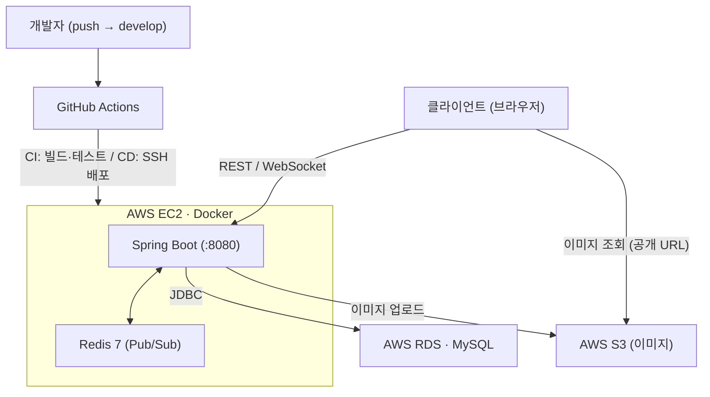
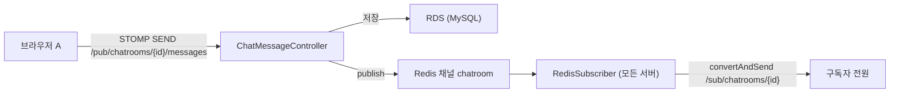
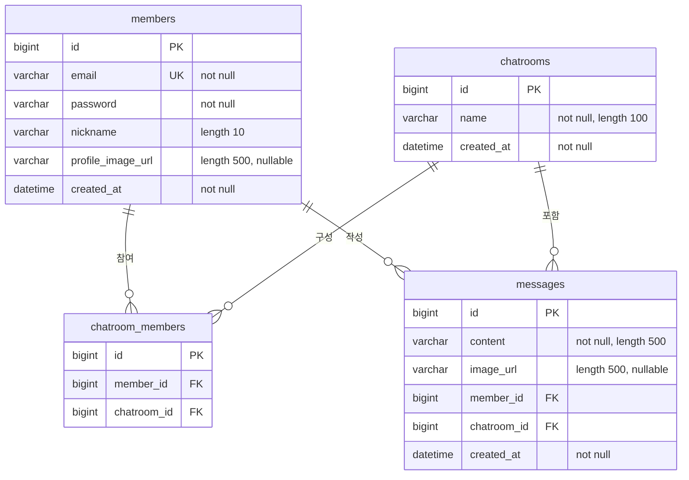
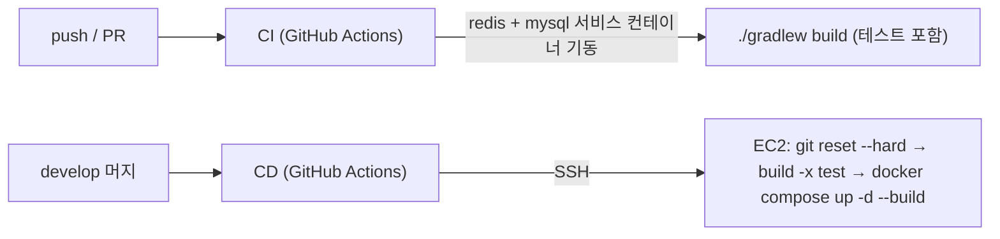

# 💬 Realtime Chat

Spring Boot 기반 **실시간 채팅 서비스**입니다.
JWT 인증 → WebSocket(STOMP) 실시간 송수신 → **Redis Pub/Sub로 다중 서버 확장** → Docker 컨테이너화 → **AWS 배포 + GitHub Actions CI/CD** → S3 이미지 업로드까지, 하나의 서비스를 처음부터 끝까지 완성하는 것을 목표로 만들었습니다.

> 학습용 개인 프로젝트지만, **실서비스에 필요한 흐름(인증 · 실시간 · 확장 · 배포 · 자동화)** 을 실제로 구축하고 배포까지 마쳤습니다.

---

## 주요 기능

| 기능 | 설명 |
|---|---|
| **회원** | 회원가입 / 로그인(JWT 발급) / 내 정보 / 프로필 이미지 / 탈퇴(본인) |
| **채팅방** | 생성 / 조회 / 목록 / 입장 / 나가기 / 참여자 목록 |
| **실시간 채팅** | WebSocket(STOMP)으로 송수신, **Redis Pub/Sub 경유 브로드캐스트** |
| **이미지** | S3 업로드 후 공개 URL 발급 → 프로필/채팅 메시지에 첨부 |
| **인증** | REST는 JWT 필터, WebSocket은 STOMP `CONNECT` 시 토큰 검증 |

---

## 기술 스택

**Backend**
- Java 17, Spring Boot 4.0.5, Gradle 9.4.1
- Spring Web / Spring Data JPA(Hibernate) / Spring Security / Bean Validation
- Spring WebSocket (STOMP), Spring Data Redis (Lettuce)
- JWT: `jjwt` 0.12.6 · API 문서: `springdoc-openapi` 2.8.9 · S3: `aws-sdk-java-v2` 2.31.0
- Lombok, JUnit 5, H2(테스트용 인메모리)

**Infra**
- MySQL(AWS RDS), Redis 7
- Docker / Docker Compose
- AWS EC2(Ubuntu) · RDS · S3
- GitHub Actions (CI/CD)

---

## 시스템 아키텍처



- **EC2**: Spring 앱 + Redis를 Docker Compose로 실행
- **RDS**: DB를 서버 밖 관리형으로 분리 (데이터 영속 · 서버 메모리 확보)
- **S3**: 이미지 저장, 공개 URL로 조회
- **비밀값**: 서버의 `.env`로만 주입 (레포에 커밋하지 않음)

### 실시간 메시지 흐름 (Redis Pub/Sub)



**왜 Redis인가?** `convertAndSend`는 **자기 서버에 붙은 세션에만** 메시지를 보냅니다. 서버가 여러 대가 되면 다른 서버의 사용자에게 닿지 않으므로, **Redis로 발행 → 모든 서버가 구독 → 각자 자기 클라이언트에 전달** 하는 구조로 확장했습니다.

---

## ERD



- `chatroom_members`는 **Member ↔ ChatRoom의 M:N을 풀어낸 조인 테이블**이며, `UNIQUE(member_id, chatroom_id)` 로 **중복 참여를 방지**합니다.
- 모든 PK는 `AUTO_INCREMENT`, 생성 시각은 Hibernate `@CreationTimestamp`.
- 연관관계 주인은 FK를 가진 `Message` / `ChatRoomMember` 쪽이며, 모든 `@ManyToOne`은 `LAZY`입니다.

---

## API 문서

> Swagger UI: `http://{host}:8080/swagger-ui/index.html`
> 인증이 필요한 API는 헤더에 **`Authorization: Bearer {accessToken}`** 을 넣습니다.

### 인증 / 회원

| Method | Path | 인증 | 설명 |
|---|---|:--:|---|
| `POST` | `/api/auth/login` | — | 로그인 → `{ tokenType, accessToken }` |
| `POST` | `/api/members` | — | 회원가입 (`email`, `password`, `nickname`) |
| `GET` | `/api/members` | ✅ | 회원 목록 |
| `GET` | `/api/members/me` | ✅ | 내 정보 |
| `GET` | `/api/members/{id}` | ✅ | 회원 단건 조회 |
| `PATCH` | `/api/members/me/profile-image` | ✅ | 프로필 이미지 변경 (`imageUrl`) |
| `DELETE` | `/api/members/me` | ✅ | 회원 탈퇴 (**본인만**) |

### 채팅방

| Method | Path | 인증 | 설명 |
|---|---|:--:|---|
| `POST` | `/api/chatrooms` | ✅ | 채팅방 생성 (`name`) |
| `GET` | `/api/chatrooms` | ✅ | 채팅방 목록 |
| `GET` | `/api/chatrooms/{id}` | ✅ | 채팅방 조회 |
| `POST` | `/api/chatrooms/{chatroomId}/members` | ✅ | 채팅방 입장 |
| `GET` | `/api/chatrooms/{chatroomId}/members` | ✅ | 참여자 목록 |
| `DELETE` | `/api/chatrooms/{chatroomId}/members` | ✅ | 채팅방 나가기 |

### 메시지 / 이미지

| Method | Path | 인증 | 설명 |
|---|---|:--:|---|
| `POST` | `/api/chatrooms/{chatroomId}/messages` | ✅ | 메시지 저장 (REST, **브로드캐스트 없음**) |
| `GET` | `/api/chatrooms/{chatroomId}/messages` | ✅ | 메시지 목록 |
| `POST` | `/api/images` | ✅ | 이미지 업로드 (`multipart/form-data`, 최대 10MB) → `{ "url": "https://..." }` |

### WebSocket (STOMP)

| 항목 | 값 |
|---|---|
| 핸드셰이크 | `ws://{host}:8080/ws` |
| 인증 | `CONNECT` 프레임 네이티브 헤더 `Authorization: Bearer {token}` |
| 전송(SEND) | `/pub/chatrooms/{chatroomId}/messages` — `{ "content": "...", "imageUrl": "..." }` |
| 구독(SUBSCRIBE) | `/sub/chatrooms/{chatroomId}` |
| 수신 페이로드 | `{ messageId, content, imageUrl, memberId, nickname, chatroomId, createdAt }` |

> **실시간 전송은 STOMP 경로만** 브로드캐스트됩니다. REST 메시지 API는 저장 전용입니다.
> **이미지 첨부는 2단계**입니다 — WebSocket으로 파일을 보낼 수 없으므로, `POST /api/images`로 먼저 업로드해 URL을 받고 그 URL만 메시지에 실어 보냅니다.

---

## 실행 방법

### 1) 환경변수 (`.env`)

프로젝트 루트에 `.env` 를 만듭니다. **비밀값은 커밋하지 않습니다.**

```bash
SPRING_DATASOURCE_URL=jdbc:mysql://{DB호스트}:3306/spring_realtimechat_service
SPRING_DATASOURCE_USERNAME={DB유저}
SPRING_DATASOURCE_PASSWORD={DB비밀번호}
AWS_ACCESS_KEY_ID={S3 업로드용 IAM 키}
AWS_SECRET_ACCESS_KEY={S3 업로드용 IAM 시크릿}
JWT_SECRET={32바이트 이상 랜덤 문자열}
```

> `JWT_SECRET`은 **기본값이 없습니다** — 설정하지 않으면 애플리케이션이 기동되지 않습니다(취약한 상태로 조용히 뜨는 것을 막기 위한 의도).
> 생성: `openssl rand -base64 32`

### 2) Docker Compose (권장)

```bash
./gradlew build          # jar 먼저 생성 (Dockerfile이 build/libs의 jar를 사용)
docker compose up --build
```
- 컴포즈가 띄우는 것: **app + redis**
- 외부 의존: **MySQL(RDS)**, **S3**
- 앱: `http://localhost:8080`

### 3) 로컬 실행 (Docker 없이)

MySQL(`localhost:3306`, DB `spring_realtimechat_service`)과 Redis(`localhost:6379`)가 필요합니다.

```bash
export JWT_SECRET=$(openssl rand -base64 32)
./gradlew bootRun
```

### 4) 테스트

```bash
./gradlew test
```
테스트는 **H2 인메모리 DB**와 더미 설정을 사용해 독립적으로 실행됩니다. (단, 컨텍스트 로드 시 Redis 연결이 필요합니다)

---

## CI/CD



**CI** (`.github/workflows/ci.yml`) — 모든 push/PR에서 실행
- Redis·MySQL을 **service container**로 띄워 통합 테스트가 실제로 통과하는지 검증

**CD** (`.github/workflows/cd.yml`) — `develop` 머지 시 자동 배포
- `appleboy/ssh-action`으로 EC2 접속 → 최신 코드로 정렬 → 빌드 → 컨테이너 재기동
- Secrets: `EC2_HOST`, `EC2_SSH_KEY`

---

## 프로젝트를 진행하며 해결한 문제

| 문제 | 원인 | 해결 |
|---|---|---|
| 서버가 여러 대면 메시지가 안 감 | `convertAndSend`는 **자기 서버 세션에만** 전달 | **Redis Pub/Sub** 경유 브로드캐스트 |
| 컨테이너에서 DB 접속 실패 | 컨테이너 안 `localhost`는 **자기 자신** | Compose **서비스 이름**으로 접속 + env 주입 |
| 앱이 DB보다 먼저 떠서 죽음 | `depends_on`은 **기동**만 보장 | MySQL **healthcheck** + `condition: service_healthy` |
| 배포 후 앱이 계속 죽음 | 1GB 서버에서 MySQL까지 돌려 **OOM** | **DB를 RDS로 분리** (+ swap, `.dockerignore`, `--no-daemon`) |
| CI에서 테스트 전부 실패 | 러너엔 Redis/MySQL이 없음 | **service containers** 로 의존 서비스 기동 |

---

## 라이선스 / 기타

- 개인 학습용 프로젝트입니다.
- 문서 기준 시점의 코드와 배포 구성을 반영합니다.
